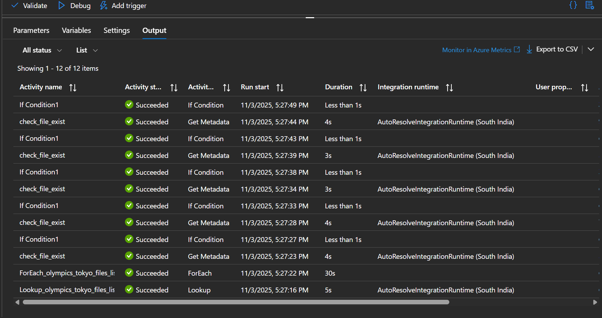
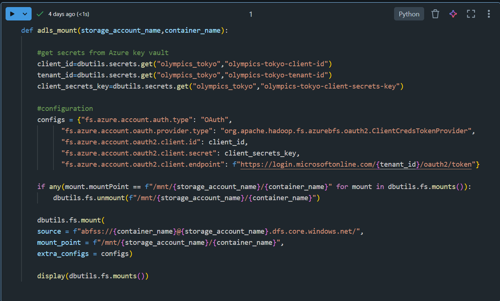

# Tokyo Olympics Data Engineering Project

## Overview
This project demonstrates an end-to-end Data Engineering pipeline built on **Microsoft Azure** using **Azure Data Factory (ADF)**, **Azure Databricks**, and **Azure Data Lake Storage Gen2**.  
The pipeline ingests, transforms, and processes **Tokyo Olympics datasets** from GitHub into Azure Data Lake and prepares them for downstream analytics.

---

### Components Used
- **Azure Data Factory (ADF)** – Orchestrates the data pipeline using Lookup, ForEach, Get Metadata, If Condition, and Copy Data activities.
- **Azure Data Lake Storage Gen2** – Stores raw and processed data.
- **Azure Databricks** – Performs data transformation and cleaning using PySpark.
  
---

## Dataset
Data Source: [Tokyo Olympics Dataset](https://github.com/yuva10/azure-data-engineering-tokyo-olympics)

### Files Used
- Athletes.csv
- Coaches.csv
- EntriesGender.csv
- Medals.csv
- Teams.csv

---

## Pipeline Workflow
### 1. Ingestion
- Used **Lookup** activity to read `olympics_tokyo_files_list.json` (file list with BaseURL and FileName).
- **ForEach** loop iterates through each file.
- Inside loop:
  - **Get Metadata** → checks if file exists in sink.
  - **If Condition** → if not exists, executes **Copy Data** activity from GitHub → Azure Data Lake Gen2 (raw container).

### 2. Transformation
- Mounted Azure Data Lake to Databricks using **Service Principal**.
- Cleaned and transformed data using **PySpark**.
- Saved transformed data to **processed** container in Azure Data Lake Gen2.

### 3. Monitoring
- ADF Pipeline Monitoring

- Databricks Mount

---

## Skills Demonstrated
- Azure Data Factory (ADF)
- Azure Databricks
- PySpark for Data Transformation
- Azure Data Lake Storage Gen2
- Service Principal Authentication
- Data Pipeline Orchestration and Monitoring
- Power BI Integration (optional)

---

## Future Enhancements
- Automate data validation checks
- Add incremental data loads
- Integrate Power BI dashboard

---

## Author
**Yuva Kumar**  
📧 Email: [yuvakumar010@gmail.com]  
🔗 GitHub: [github.com/yuva10](https://github.com/yuva10)  
🔗 LinkedIn: [your-linkedin-profile](https://www.linkedin.com/in/yuva-kumar/)

